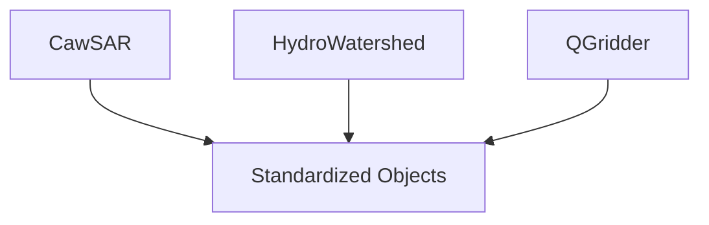
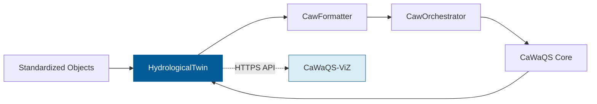
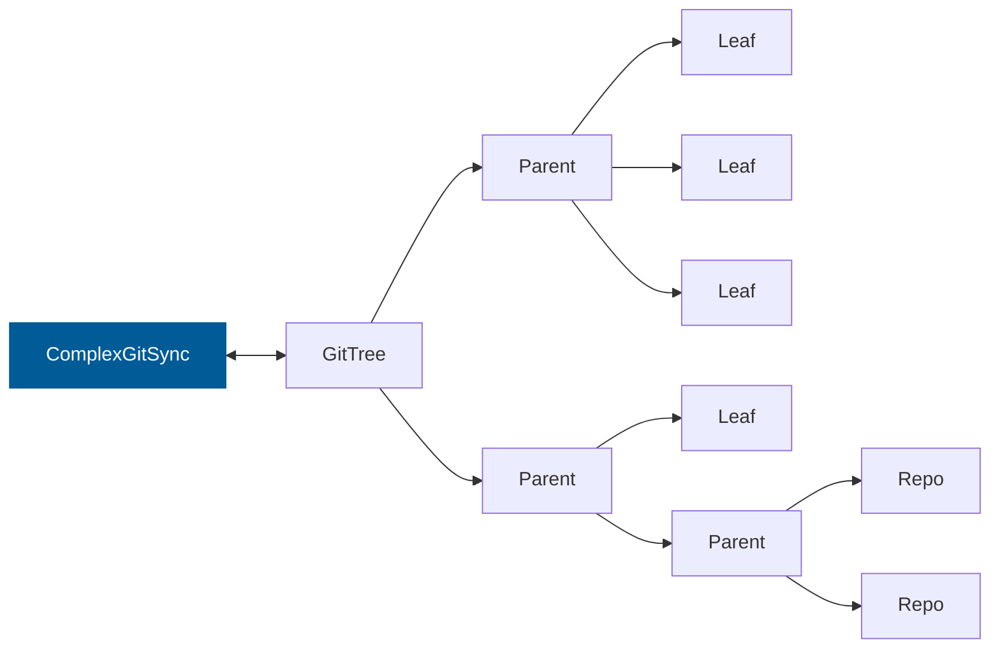
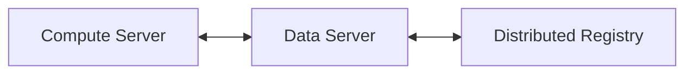
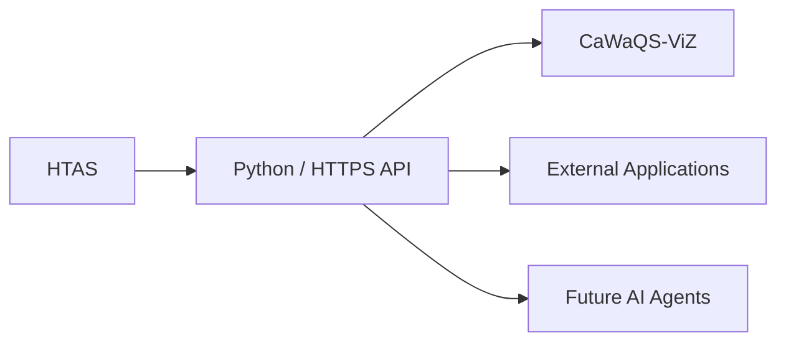

---
# try also 'default' to start simple
#theme: default
theme: seriph
# random image from a curated Unsplash collection by Anthony
# like them? see https://unsplash.com/collections/94734566/slidev
background: /figures/terre_vue_du_ciel.jpg
# some information about your slides (markdown enabled)
title: Hydrological Twin
info: |
  ## Slidev Starter Template
  Concepts and use cases

  Learn more at [Sli.dev](https://sli.dev)
# apply UnoCSS classes to the current slide
class: text-center
# https://sli.dev/features/drawing
drawings:
  persist: false
# slide transition: https://sli.dev/guide/animations.html#slide-transitions
transition: slide-left
# enable Comark Syntax: https://comark.dev/syntax/markdown
comark: true
# duration of the presentation
duration: 35min
---

# Hydrological Twin

Distributed Scientific Infrastructure for Water Resources

Reproducible framework EPL2.0 for environmental data integration, multi-scale   hydrological simulation, distributed provenance and decision support.

  Press Space for next page <carbon:arrow-right />

  <button @click="$slidev.nav.openInEditor()" title="Open in Editor" class="slidev-icon-btn">
    <carbon:edit />
  </button>
  <a href="https://github.com/slidevjs/slidev" target="_blank" class="slidev-icon-btn">
    <carbon:logo-github />
  </a>

<!--
The last comment block of each slide will be treated as slide notes. It will be visible and editable in Presenter Mode along with the slide. [Read more in the docs](https://sli.dev/guide/syntax.html#notes)
-->

---
layout: default
background: white
class: text-slate-800
---

---
transition: fade-out
---

# A scientific, model agnostic, multi-scale, digital twin for water resources

Observe → Analyze → Predict → Decide

<!--HydrologicalTwin transforms heterogeneous environmental datasets into actionable knowledge for sustainable water resources management.-->

---

# Hydrological Twin

A scientific, model-agnostic, multi-scale digital twin for water resources

• Hydrosystems

• Multi-Scale

• HPC

• Traceability

• Sovereignty

• Decision Support

---

# Pipeline

## Model-Agnostic Preprocessing

## CaWaQS Orchestration Loop

---

# ComplexGitSync

### Ensures

- Provenance
- Synchronization
- Traceability
- Versioning
- Reproducibility

---

# Distributed Infrastructure

### Compute Server

* Executes simulations
* Hosts HTAS services

### Data Server

* Stores datasets
* Stores metadata

### Distributed Registry

* Provenance
* Simulation outputs
* Object addresses
* Version history

---

# Service Layer

---

# Typical Use Cases

### Multi-scale Water Allocation

Optimize resource sharing under competing demands over various spatial and temporal scales.

### Drought Management

Anticipate shortages and assess mitigation strategies.

### Flood Risk Assessment

Simulate extreme hydrological events for basin wide planning

### Groundwater Management

Evaluate sustainability of abstractions.

### Climate Adaptation

Explore long-term hydroclimatic scenarios.

---

# Core Principles

| Principle        | Description                          |
| ---------------- | ------------------------------------ |
| Determinism      | Reproducible scientific workflows    |
| Provenance       | Full lineage of data and simulations |
| Modularity       | Separation of concerns               |
| Interoperability | Open APIs                            |
| Scalability      | HPC and distributed execution        |
| Transparency     | Auditable results                    |

---

# Expected Outcomes

## 💧

### Water Security

## 🌍

### Climate Adaptation

## 🌱

### Ecosystem Preservation

## 📈

### Risk Anticipation

## ⚖️

### Sustainable Allocation

## 🏛️

### Territorial Resilience

 

From environmental data to actionable knowledge

