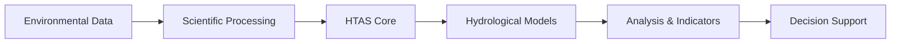
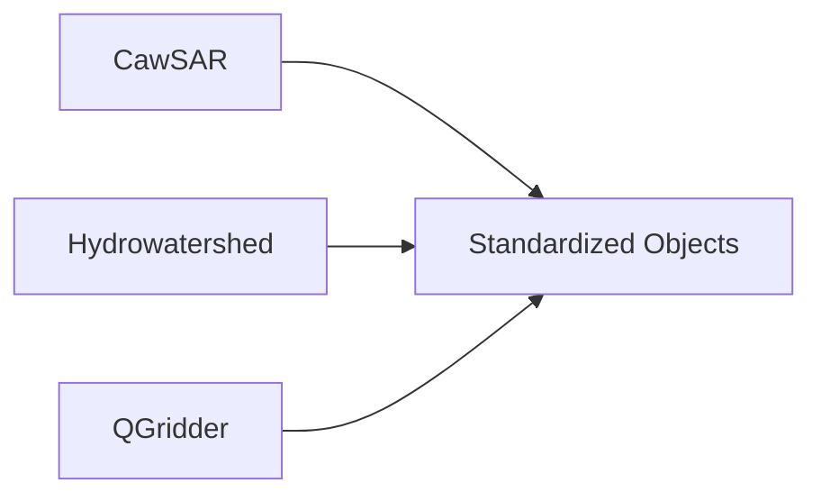
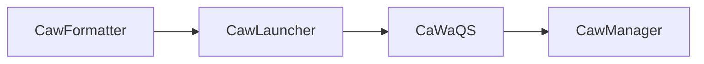
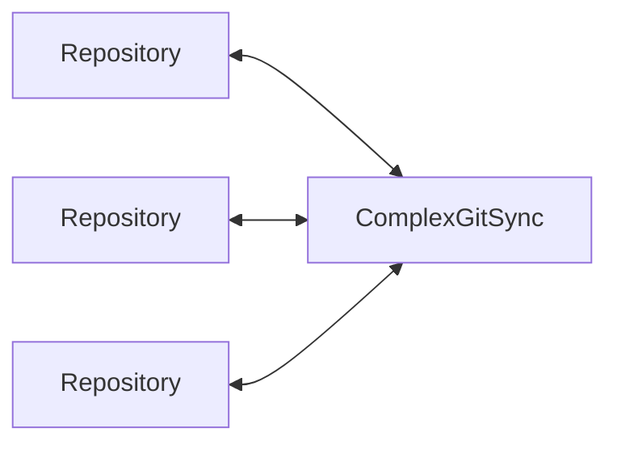
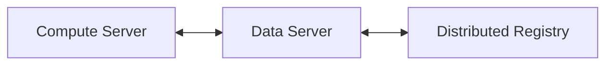
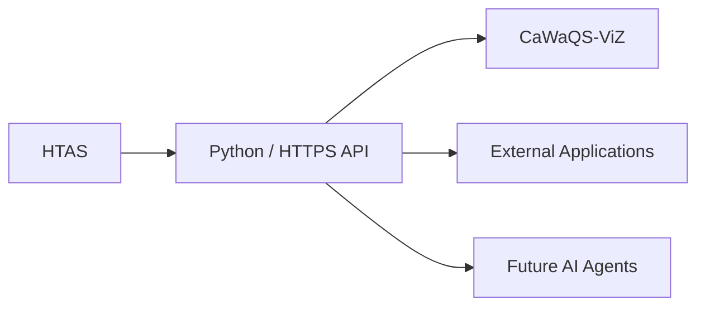
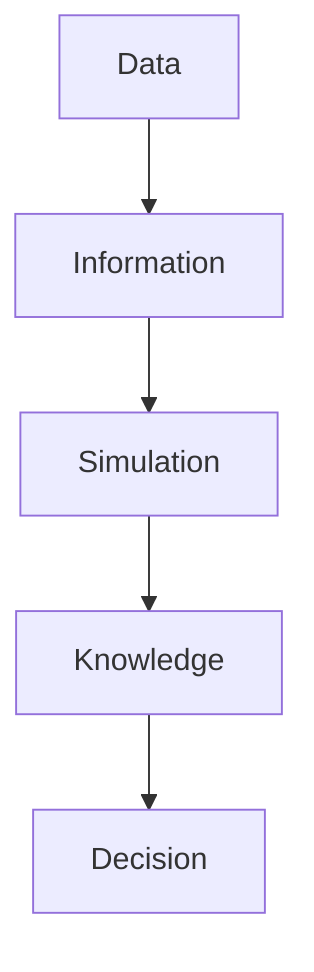

---
# try also 'default' to start simple
#theme: default
theme: seriph
# random image from a curated Unsplash collection by Anthony
# like them? see https://unsplash.com/collections/94734566/slidev
background: /figures/terre_vue_du_ciel.jpg
# some information about your slides (markdown enabled)
title: Hydrological Twin
info: |
  ## Slidev Starter Template
  Concepts and use cases

  Learn more at [Sli.dev](https://sli.dev)
# apply UnoCSS classes to the current slide
class: text-center
# https://sli.dev/features/drawing
drawings:
  persist: false
# slide transition: https://sli.dev/guide/animations.html#slide-transitions
transition: slide-left
# enable Comark Syntax: https://comark.dev/syntax/markdown
comark: true
# duration of the presentation
duration: 35min
---

# Hydrological Twin

Distributed Scientific Infrastructure for Water Resources

Reproducible framework EPL2.0 for environmental data integration, hydrological simulation, distributed provenance and decision support.

<div @click="$slidev.nav.next" class="mt-12 py-1" hover:bg="white op-10">
  Press Space for next page <carbon:arrow-right />
</div>

<div class="abs-br m-6 text-xl">
  <button @click="$slidev.nav.openInEditor()" title="Open in Editor" class="slidev-icon-btn">
    <carbon:edit />
  </button>
  <a href="https://github.com/slidevjs/slidev" target="_blank" class="slidev-icon-btn">
    <carbon:logo-github />
  </a>
</div>

<!--
The last comment block of each slide will be treated as slide notes. It will be visible and editable in Presenter Mode along with the slide. [Read more in the docs](https://sli.dev/guide/syntax.html#notes)
-->
---
transition: fade-out
---

# A scientific, model agnostic, digital twin for water resources

<div class="text-right text-xl">
Observe → Analyze → Predict → Decide
</div>

<center>


</center>

<!--HydrologicalTwin transforms heterogeneous environmental datasets into actionable knowledge for sustainable water resources management.-->


---

# End-to-End Workflow



---

# Data Ecosystem

## Multi-Source Inputs

| Domain         | Examples                       |
| -------------- | ------------------------------ |
| Climate        | SAFRAN, ERA5                   |
| Hydrology      | River discharge, water quality |
| Groundwater    | ADES, piezometry               |
| Land Use       | CORINE Land Cover              |
| Geology        | BRGM                           |
| Socio-economic | Population, water demand       |

---

# Scientific Processing Layer

## Model-Agnostic Preprocessing



### Responsibilities

* Meteorological forcing generation
* Watershed delineation
* HRU generation
* Numerical mesh construction
* Data harmonization

---

# HTAS Core

## HydrologicalTwinAlphaSeries

The canonical orchestration layer.

```text
Domain
 ├── Compartments
 │    ├── Meshes
 │    └── Observations
 │
 └── Time Framework
      ├── Start Date
      ├── End Date
      └── Timestep
```

### Responsibilities

* Aggregate datasets
* Manage metadata
* Prepare simulation environments
* Coordinate workflows
* Expose APIs
* Guarantee reproducibility

---

# Simulation Layer

## Model-Specific Components



### CaWaQS

Physically-based distributed hydrological model

* Surface water
* Unsaturated zone
* Groundwater
* River-aquifer interactions
* Calibration
* Uncertainty assessment

---

# Distributed Provenance

## ComplexGitSync



### Guarantees

* Provenance
* Synchronization
* Traceability
* Versioning
* Reproducibility

---

# Distributed Infrastructure



### Compute Server

* Executes simulations
* Hosts HTAS services

### Data Server

* Stores datasets
* Stores metadata

### Distributed Registry

* Provenance
* Simulation outputs
* Object addresses
* Version history

---

# Service Layer



---

# Typical Use Cases

### Multi-scale Water Allocation

Optimize resource sharing under competing demands over various spatial and temporal scales.

### Drought Management

Anticipate shortages and assess mitigation strategies.

### Flood Risk Assessment

Simulate extreme hydrological events for basin wide planning

### Groundwater Management

Evaluate sustainability of abstractions.

### Climate Adaptation

Explore long-term hydroclimatic scenarios.

---

# Core Principles

| Principle        | Description                          |
| ---------------- | ------------------------------------ |
| Determinism      | Reproducible scientific workflows    |
| Provenance       | Full lineage of data and simulations |
| Modularity       | Separation of concerns               |
| Interoperability | Open APIs                            |
| Scalability      | HPC and distributed execution        |
| Transparency     | Auditable results                    |

---

# Expected Outcomes



### Impact

* Water security
* Risk anticipation
* Sustainable allocation
* Ecosystem preservation
* Climate adaptation
* Territorial resilience

---

# HydrologicalTwin

### Distributed Scientific Infrastructure for Water Resources

<div class="text-center">

Observe → Analyze → Predict → Decide

</div>

<br>

Built upon:

* HTAS (HydrologicalTwinAlphaSeries)
* CaWaQS
* ComplexGitSync
* CaWaQS-ViZ

to deliver reproducible scientific digital twins for water resources management.
